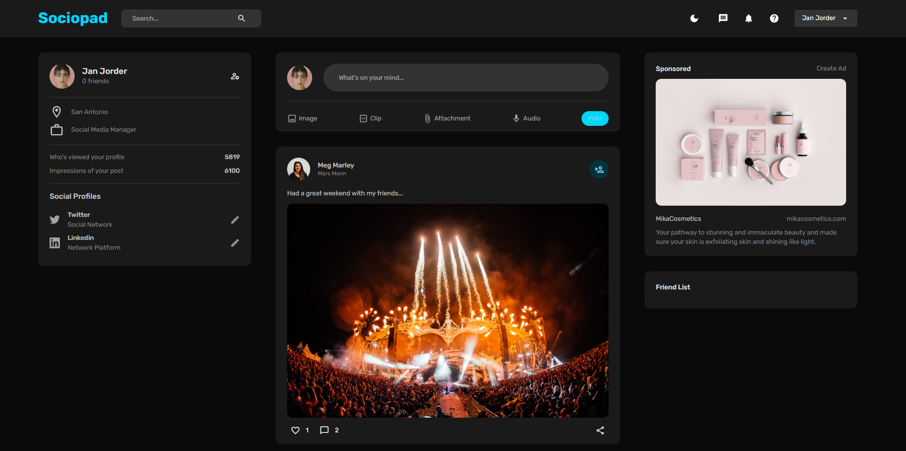

# FullStack Social Media App
Complete React MERN Full Stack Social Media App. 

# Introduction
This is social media web app. 

The concepts covered in this app are:
- User Authentication
- Login, Registration
- Theme Mode
- React, Redux, Material UI and etc

# Project structure
- Client
- Server

# Screenshots
 

# Credits
[Ed Roh](https://github.com/ed-roh)

[Build a COMPLETE Fullstack Responsive MERN App with Auth, Likes, Dark Mode | React, MongoDB, MUI](https://www.youtube.com/watch?v=K8YELRmUb5o)